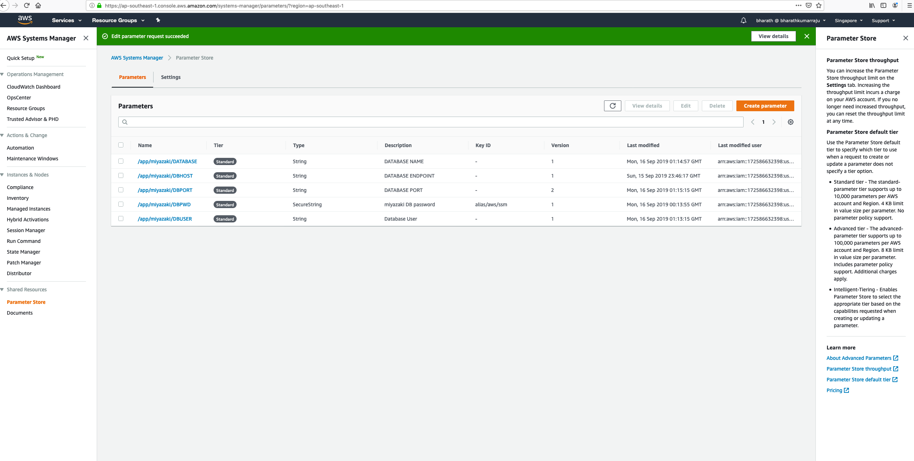
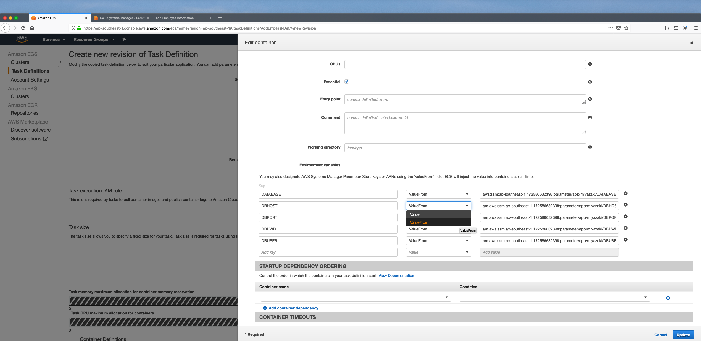

# ECS_Parameterstore
AWS ECS with aws system Parameter stores

### Application can be accessed here

http://AWSEcsApplicationLoadbalancer-2024742083.ap-southeast-1.elb.amazonaws.com

### Environment varibales can be used as here

### Environment Variables

To access the each parameter inside the container definition use ARN as below for each environment.

SSM URN - arn:aws:ssm:ap-southeast-1:172586632398:parameter/<name>

- /app/miyazaki/DBHOST : XXXXXXXXX  -> arn:aws:ssm:ap-southeast-1:172586632398:parameter/app/miyazaki/DBHOST

- /app/miyazaki/DBPORT : 3306 -> arn:aws:ssm:ap-southeast-1:172586632398:parameter/app/miyazaki/DBPORT

- /app/miyazaki/DBPWD : XXXXXX -> arn:aws:ssm:ap-southeast-1:172586632398:parameter/app/miyazaki/DBPWD

- /app/miyazaki/DBUSER : XXXXX -> arn:aws:ssm:ap-southeast-1:172586632398:parameter/app/miyazaki/DBUSER

- /app/miyazaki/DATABASE : XXXXX  -> arn:aws:ssm:ap-southeast-1:172586632398:parameter/app/miyazaki/DATABASE

### use above values in contianer defintions as below.

